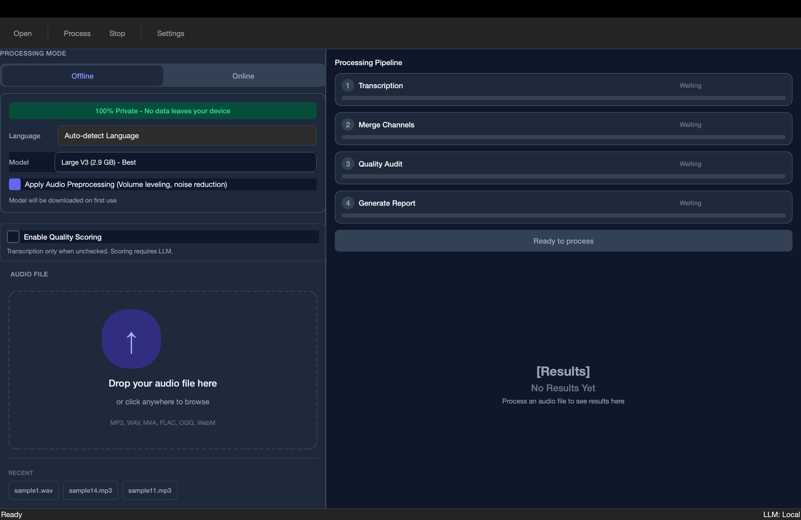
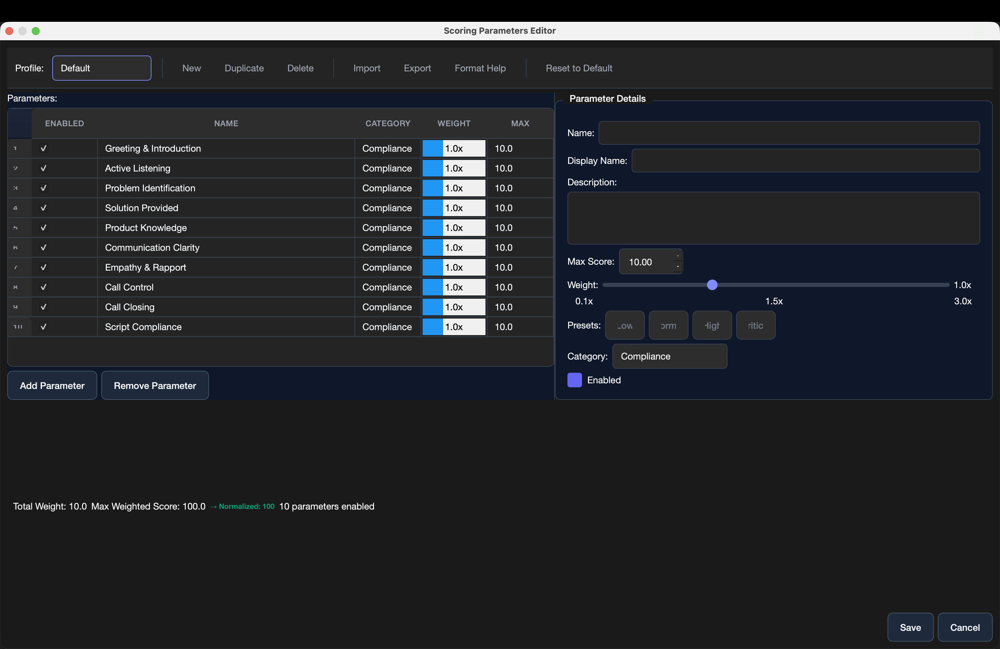
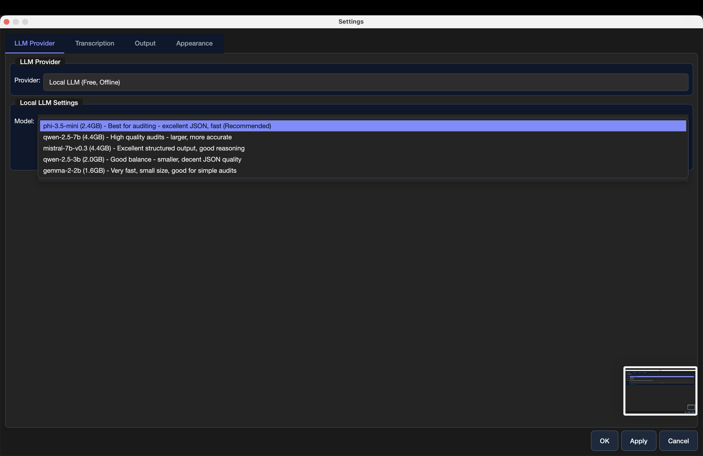
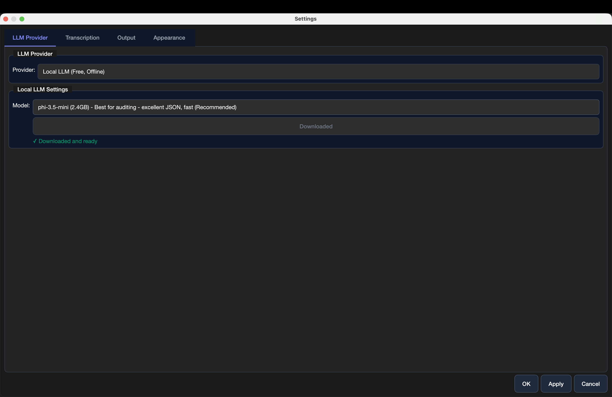
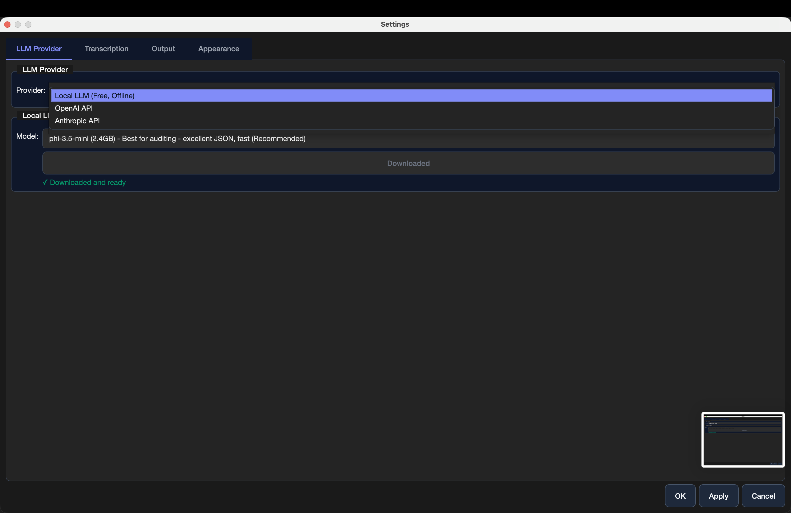
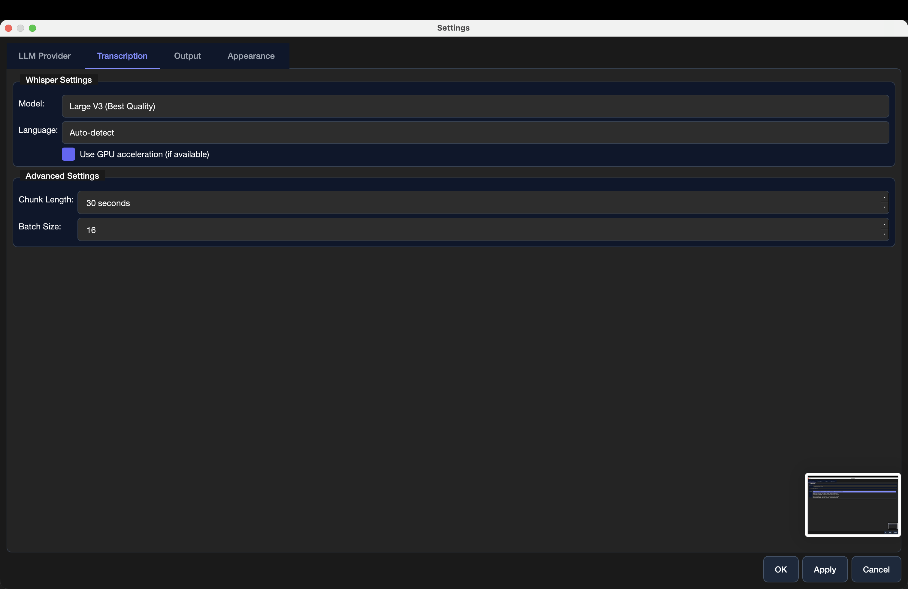
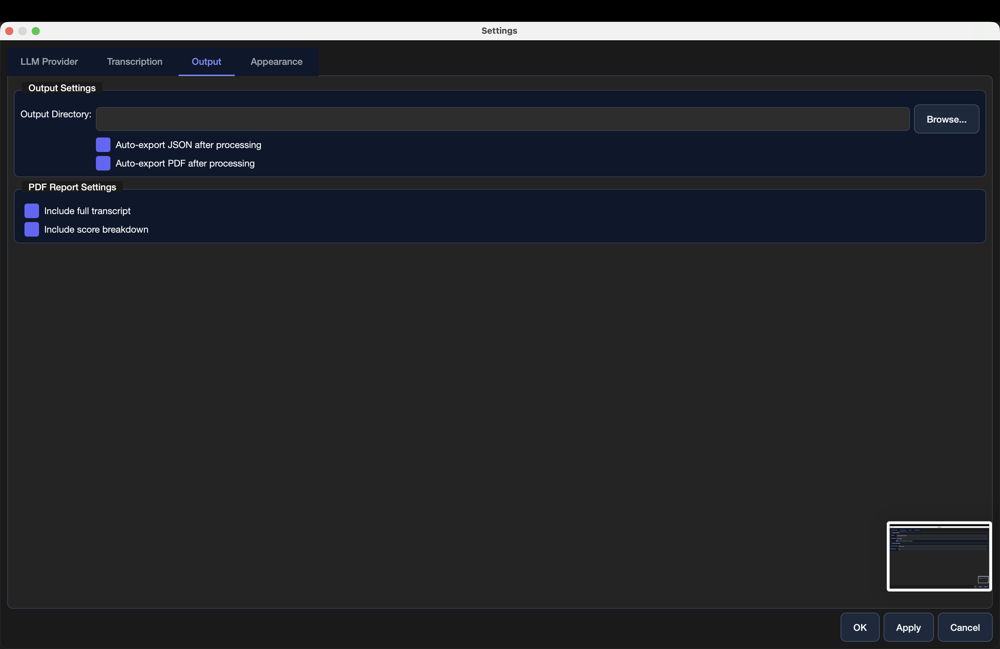
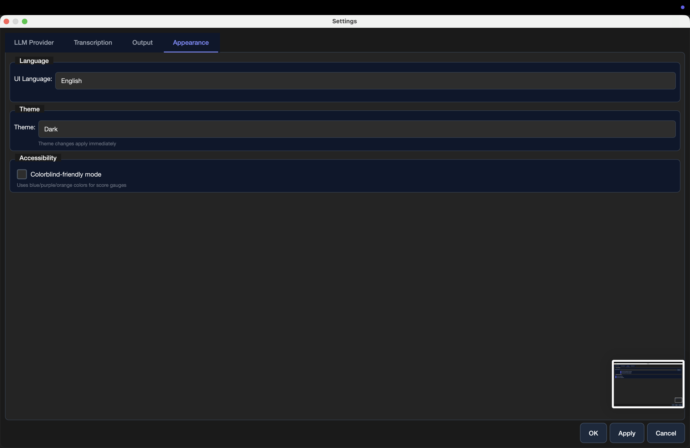

# LocalMind
## Technical Guide

---

**Transform Audio into Intelligence**

Professional-grade transcription with AI-powered quality analysis.
100% offline. Zero cost. Complete privacy.

---

## Contents

- [Quick Start](#quick-start)
- [Your First Transcription](#your-first-transcription)
- [Understanding Quality Scoring](#understanding-quality-scoring)
- [Choosing the Right Model](#choosing-the-right-model)
- [Settings](#settings)
- [Export & Share](#export--share)
- [Troubleshooting](#troubleshooting)

---

## Quick Start

### What You Need

- **macOS** 10.15 or later
- **4GB RAM** minimum (8GB recommended)
- **Audio file** in MP3, WAV, M4A, FLAC, OGG, or WEBM format

### First Launch

1. Download LocalMind
2. Move to Applications folder
3. Double-click to open
4. Grant permissions if prompted

That's it. No account. No subscription. No internet required.

---

## Your First Transcription

### Step 1: Add Your Audio

Drag and drop your audio file into the window.

**Supported formats:**
MP3 · WAV · M4A · FLAC · OGG · WEBM

**File size:**
Up to 2GB per file

### Step 2: Configure Processing

Choose your preferences:

**Processing Mode:**
- **Offline** - Processes locally on your device
- **Online** - Uses cloud AI (requires API keys)

**Language:**
Auto-detect or select from 50+ languages

**Model:**
Large V3 (Best Quality) - Recommended for first use

**Audio Preprocessing:**
Enable noise reduction for clearer results

### Step 3: Process

Click **Process** and watch the pipeline:

1. **Transcription** - Converting speech to text
2. **Merge Channels** - Combining audio streams
3. **Quality Audit** - AI-powered analysis
4. **Generate Report** - Creating comprehensive output

**Processing time:**
10-minute audio ≈ 5-7 minutes on average laptop

---

## Understanding Quality Scoring

LocalMind doesn't just transcribe—it evaluates your conversations using advanced AI reasoning.

### Default Parameters

**Compliance** (1.0x weight)
- Greeting & Introduction
- Active Listening
- Problem Identification
- Solution Provided
- Product Knowledge
- Communication Clarity
- Empathy & Rapport
- Call Control
- Call Closing
- Script Compliance

### Customizing Scores

Adjust parameter weights from 0.1x to 3.0x:

- **Higher weight** = More important to overall score
- **Lower weight** = Less impact on final rating

**Example:** For sales calls, increase "Product Knowledge" to 2.5x

### How Scoring Works

LocalMind uses **Chain of Thought (CoT) reasoning**:

1. Analyzes full transcript context
2. Identifies key moments and patterns
3. Evaluates against each parameter
4. Provides detailed explanations
5. Calculates weighted final score

**Result:** Understand not just *what* was said, but *how well* it was communicated.

---

## Choosing the Right Model

### Transcription Models

#### Qwen 2.5 (7B) - Best for auditing (Recommended)

- **Size:** 4GB
- **Speed:** Fast
- **Quality:** Excellent JSON output
- **Best for:** Quality analysis, professional use

#### Qwen 2.7B (6.4GB) - High quality audio

- **Size:** 6.4GB
- **Speed:** Moderate
- **Quality:** Very accurate for clear audio
- **Best for:** Structured transcription

#### Mixtral 7b-v3 (4.6GB) - Excellent output

- **Size:** 4.6GB
- **Speed:** Balanced
- **Quality:** Great reasoning ability
- **Best for:** Good all-around performance

#### Qwen 2.5 (3.2B) - Good balance

- **Size:** 3.2GB
- **Speed:** Faster
- **Quality:** Good for most use cases
- **Best for:** Smaller files, quick processing

#### Gemma 2 (2.6GB) - Very fast

- **Size:** 2.6GB
- **Speed:** Very fast
- **Quality:** Good for simple audio
- **Best for:** Fast turnaround needs

### Whisper Models

**Large V3** - Maximum accuracy (97-99%)
**Medium** - Balanced performance (95-97%)
**Base** - Speed priority (90-92%)

---

## Settings

Access settings via **Settings** menu or `⌘,` (Command-Comma)

### LLM Provider

Choose your AI provider:

**Local LLM (Free, Offline)**
- No internet required
- Complete privacy
- No API costs
- Recommended for most users

**OpenAI API**
- Requires API key
- Pay per use
- Cloud processing

**Anthropic API**
- Requires API key
- Advanced reasoning
- Cloud processing

### Transcription Settings

**Model:** Large V3 (Best Quality)

**Language:** Auto-detection
Automatically identifies the spoken language

**GPU Acceleration:**
Enable for 3-5x faster processing (if available)

**Advanced Settings:**

- **Chunk Length:** 30 seconds (default)
- **Batch Size:** 16 (adjust based on RAM)

### Output Settings

**Output Directory:**
Choose where to save results

**Auto-export after processing:**
- ✓ Auto-export JSON
- ✓ Auto-export PDF

**PDF Report Settings:**
- ✓ Include full transcript
- ✓ Include score breakdown

### Appearance

**UI Language:**
English · Español · 日本語 · العربية · हिन्दी · Русский · Français · 中文

**Theme:**
Dark · Light · System

**Accessibility:**
- Colorblind-friendly mode
  Uses blue/purple/orange colors for score gauges

---

## Export & Share

### Available Formats

**JSON**
Machine-readable data with full transcript and scores

**PDF**
Professional report with formatting and visualizations

**TXT**
Plain text transcript only

### Exporting

1. Complete processing
2. Click **Export** button
3. Choose format(s)
4. Select destination
5. Click **Save**

Files are named automatically:
`filename_transcript_2026-01-18.pdf`

---

## Multilingual Support

LocalMind speaks your language.

### Supported UI Languages

- 🇬🇧 **English**
- 🇪🇸 **Español** (Spanish)
- 🇯🇵 **日本語** (Japanese)
- 🇦🇪 **العربية** (Arabic) - with RTL layout
- 🇮🇳 **हिन्दी** (Hindi)
- 🇷🇺 **Русский** (Russian)
- 🇫🇷 **Français** (French)
- 🇨🇳 **中文** (Chinese Simplified)

### Change Language

**Settings → Appearance → UI Language**

Changes apply immediately. No restart required.

### Transcription Languages

LocalMind transcribes **50+ languages** including:

English · Spanish · French · German · Italian · Portuguese · Dutch · Russian · Arabic · Hindi · Japanese · Korean · Chinese · and many more

---

## Troubleshooting

### Processing Takes Too Long

**Try this:**
- Use smaller Whisper model (Medium instead of Large)
- Enable GPU acceleration in Settings
- Close other applications to free RAM
- Process shorter audio segments

### Low Quality Scores

**Remember:**
- Quality scoring requires LLM to be downloaded
- First run downloads models (may take time)
- Ensure "Enable Quality Scoring" is checked
- Check that audio quality is good

### Audio Not Loading

**Check:**
- File format is supported (MP3, WAV, M4A, FLAC, OGG, WEBM)
- File size is under 2GB
- File is not corrupted
- You have read permissions for the file

### App Won't Open

**macOS Security:**
1. Right-click LocalMind
2. Select "Open"
3. Click "Open" in security dialog
4. Grant permissions if requested

### Models Not Downloading

**Check:**
- You have internet connection (for first download)
- Sufficient disk space (models are 2-7GB each)
- Firewall allows HuggingFace connections
- No VPN blocking downloads

---

## Privacy & Security

### What LocalMind Collects

**Nothing.**

- No telemetry
- No analytics
- No crash reports
- No usage statistics

Your audio never leaves your device in offline mode.

### Data Storage

All data stored locally:
- **Transcripts:** Your chosen output directory
- **Models:** `~/.cache/localmind/`
- **Settings:** `~/Library/Application Support/localmind/`

### Open Source

LocalMind is open source (MIT License).

Audit the code yourself: [github.com/prepladder/localmind](https://github.com/prepladder/localmind)

---

## Advanced Tips

### Optimize Processing Speed

1. **Use GPU acceleration** if you have a Mac with M-series chip
2. **Choose appropriate model size** - Medium is sufficient for most needs
3. **Increase batch size** in advanced settings (if you have 16GB+ RAM)
4. **Process during off-hours** for background operation

### Improve Transcription Accuracy

1. **Use highest quality audio** possible
2. **Enable audio preprocessing** for noisy recordings
3. **Select correct language** instead of auto-detect
4. **Use Large V3 model** for critical transcriptions

### Batch Processing

Process multiple files efficiently:

1. Process first file with desired settings
2. Settings are remembered for next file
3. Enable auto-export to save time
4. Use same output directory for organized results

### Custom Scoring Profiles

Create profiles for different use cases:

**Sales Calls:**
- Product Knowledge: 2.5x
- Communication Clarity: 2.0x
- Call Closing: 2.0x

**Support Calls:**
- Empathy & Rapport: 2.5x
- Problem Identification: 2.0x
- Solution Provided: 2.5x

**Compliance Audits:**
- Script Compliance: 3.0x
- Greeting & Introduction: 2.0x
- Call Closing: 2.0x

---

## System Requirements

### Minimum

- macOS 10.15 Catalina or later
- 4GB RAM
- 10GB free disk space
- Intel or Apple Silicon processor

### Recommended

- macOS 12 Monterey or later
- 8GB RAM or more
- 20GB free disk space
- Apple M-series chip (for GPU acceleration)

---

## Getting Help

### Documentation

Full documentation: [docs.localmind.ai](https://docs.localmind.ai)

### Community

- GitHub Issues: [github.com/prepladder/localmind/issues](https://github.com/prepladder/localmind/issues)
- Discussions: [github.com/prepladder/localmind/discussions](https://github.com/prepladder/localmind/discussions)

### Contact

- Email: support@localmind.ai
- Website: [localmind.ai](https://localmind.ai)

---

## About LocalMind

LocalMind was built to give everyone access to professional-grade transcription and quality analysis without sacrificing privacy or paying monthly subscriptions.

**Our Promise:**

- ✓ Always free
- ✓ Always offline-capable
- ✓ Always open source
- ✓ Always privacy-focused

**Version:** 1.0.0
**Last Updated:** January 2026

---

**Made with care for researchers, podcasters, journalists, call centers, legal professionals, and anyone who values their privacy.**

---

© 2026 LocalMind. Released under MIT License.
