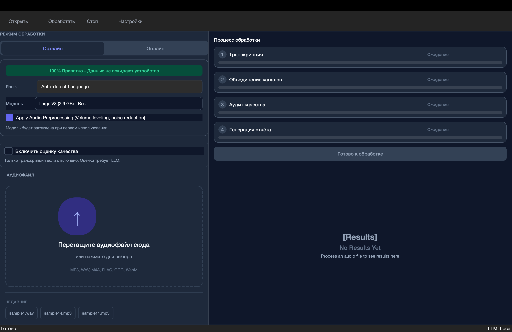
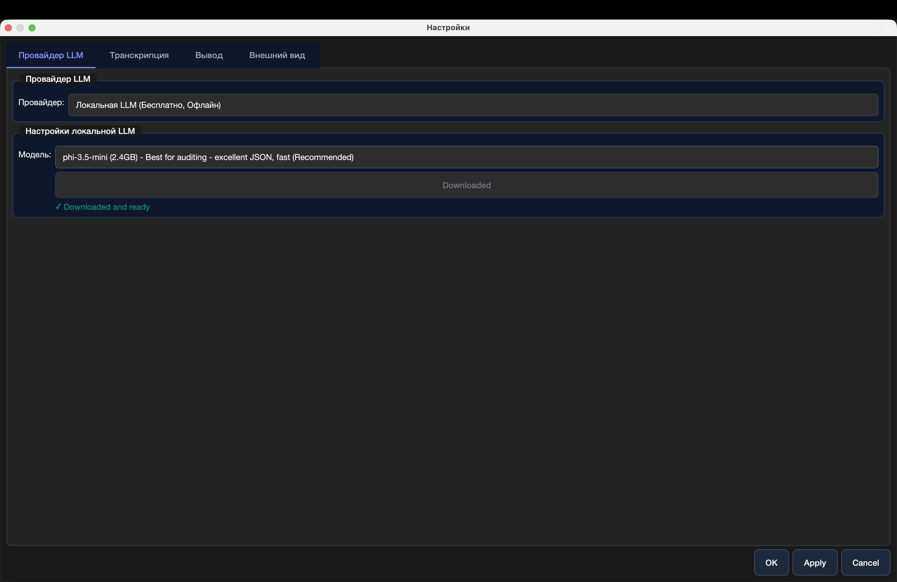
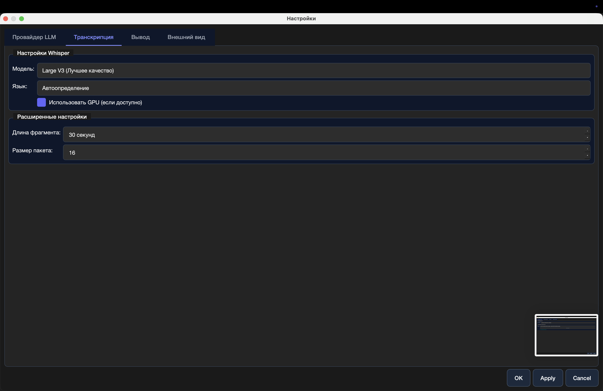
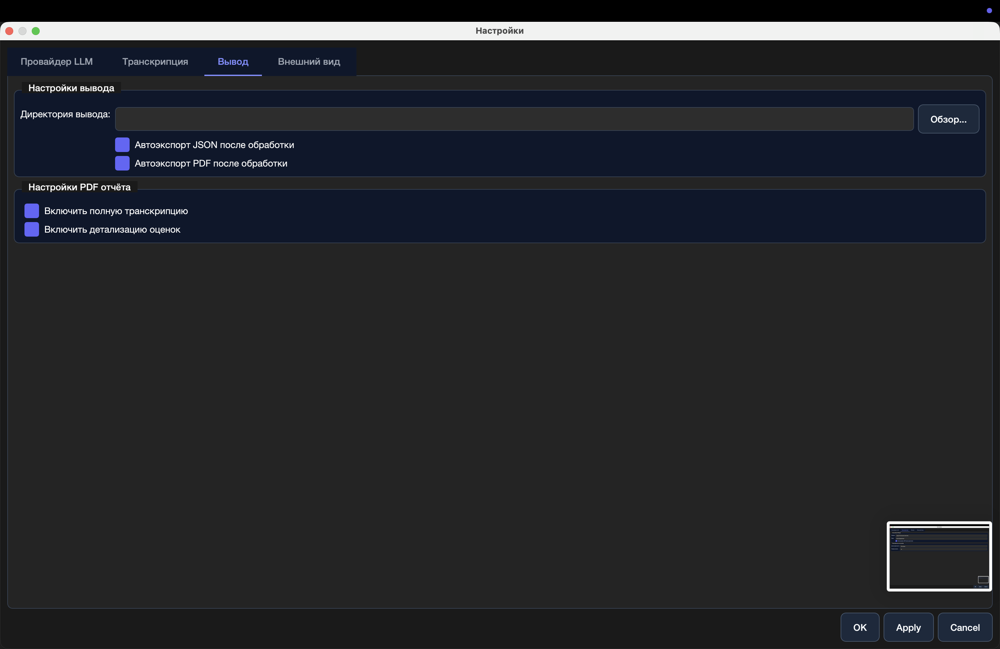
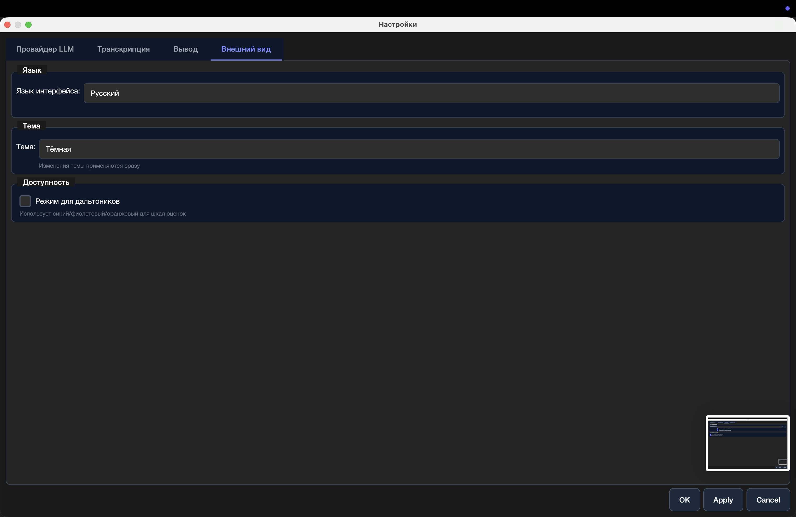
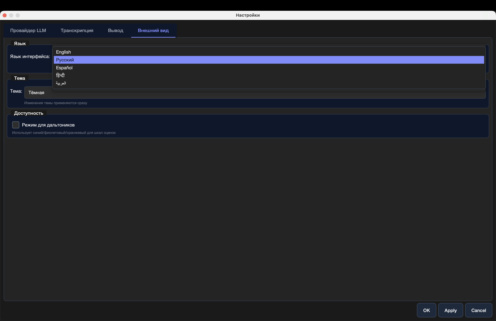

# LocalMind
## Техническое руководство

---

**Превратите аудио в аналитику**

Профессиональная транскрипция с AI-анализом качества.
100% офлайн. Нулевая стоимость. Полная конфиденциальность.

---

## Содержание

- [Быстрый старт](#быстрый-старт)
- [Ваша первая транскрипция](#ваша-первая-транскрипция)
- [Понимание оценки качества](#понимание-оценки-качества)
- [Выбор подходящей модели](#выбор-подходящей-модели)
- [Настройки](#настройки)
- [Экспорт и публикация](#экспорт-и-публикация)
- [Устранение неполадок](#устранение-неполадок)

---

## Быстрый старт

### Что вам нужно

- **macOS** 10.15 или новее
- **4GB RAM** минимум (рекомендуется 8GB)
- **Аудиофайл** в формате MP3, WAV, M4A, FLAC, OGG или WEBM

### Первый запуск

1. Загрузите LocalMind
2. Переместите в папку Программы
3. Дважды щёлкните для открытия
4. Предоставьте разрешения при необходимости

Вот и всё. Без учётной записи. Без подписки. Без интернета.

---

## Ваша первая транскрипция

### Шаг 1: Добавьте аудио

Перетащите аудиофайл в окно приложения.

**Поддерживаемые форматы:**
MP3 · WAV · M4A · FLAC · OGG · WEBM

**Размер файла:**
До 2GB на файл

### Шаг 2: Настройте обработку

Выберите ваши параметры:

**Режим обработки:**
- **Офлайн** - Обработка локально на вашем устройстве
- **Онлайн** - Использует облачный AI (требуются API ключи)

**Язык:**
Автоопределение или выбор из 50+ языков

**Модель:**
Large V3 (Лучшее качество) - Рекомендуется для первого использования

**Предобработка аудио:**
Включите шумоподавление для более чистых результатов

### Шаг 3: Обработка

Нажмите **Обработать** и наблюдайте за процессом:

1. **Транскрипция** - Преобразование речи в текст
2. **Объединение каналов** - Слияние аудиопотоков
3. **Аудит качества** - AI-анализ
4. **Генерация отчёта** - Создание подробного результата

**Время обработки:**
10-минутное аудио ≈ 5-7 минут на обычном ноутбуке

---

## Понимание оценки качества

LocalMind не просто транскрибирует—он оценивает ваши разговоры с помощью продвинутого AI-анализа.

### Параметры по умолчанию

**Соответствие** (вес 1.0x)
- Приветствие и представление
- Активное слушание
- Определение проблемы
- Предоставление решения
- Знание продукта
- Ясность коммуникации
- Эмпатия и контакт
- Контроль звонка
- Завершение звонка
- Соблюдение скрипта

### Настройка оценок

Настройте веса параметров от 0.1x до 3.0x:

- **Больший вес** = Более важно для общей оценки
- **Меньший вес** = Меньшее влияние на финальный рейтинг

**Пример:** Для продаж увеличьте "Знание продукта" до 2.5x

### Как работает оценка

LocalMind использует **рассуждение по цепочке мыслей (CoT)**:

1. Анализирует полный контекст транскрипта
2. Определяет ключевые моменты и паттерны
3. Оценивает по каждому параметру
4. Предоставляет подробные объяснения
5. Рассчитывает взвешенную финальную оценку

**Результат:** Понимание не только *что* было сказано, но и *насколько хорошо* это было передано.

---

## Выбор подходящей модели

### Модели транскрипции

#### Qwen 2.5 (7B) - Лучшее для аудита (Рекомендуется)

- **Размер:** 4GB
- **Скорость:** Быстрая
- **Качество:** Отличный JSON вывод
- **Лучше для:** Анализ качества, профессиональное использование

#### Qwen 2.7B (6.4GB) - Высокое качество аудио

- **Размер:** 6.4GB
- **Скорость:** Средняя
- **Качество:** Очень точная для чистого аудио
- **Лучше для:** Структурированная транскрипция

#### Mixtral 7b-v3 (4.6GB) - Отличный вывод

- **Размер:** 4.6GB
- **Скорость:** Сбалансированная
- **Качество:** Отличная способность рассуждения
- **Лучше для:** Хорошая универсальная производительность

#### Qwen 2.5 (3.2GB) - Хороший баланс

- **Размер:** 3.2GB
- **Скорость:** Быстрее
- **Качество:** Хорошо для большинства случаев
- **Лучше для:** Небольшие файлы, быстрая обработка

#### Gemma 2 (2.6GB) - Очень быстрая

- **Размер:** 2.6GB
- **Скорость:** Очень быстрая
- **Качество:** Хорошо для простого аудио
- **Лучше для:** Потребности в быстром результате

### Модели Whisper

**Large V3** - Максимальная точность (97-99%)
**Medium** - Сбалансированная производительность (95-97%)
**Base** - Приоритет скорости (90-92%)

---

## Настройки

Доступ к настройкам через меню **Настройки** или `⌘,` (Command-Comma)

### Провайдер LLM

Выберите вашего AI-провайдера:

**Локальная LLM (Бесплатно, Офлайн)**
- Интернет не требуется
- Полная конфиденциальность
- Без затрат на API
- Рекомендуется для большинства пользователей

**OpenAI API**
- Требуется API ключ
- Оплата по использованию
- Облачная обработка

**Anthropic API**
- Требуется API ключ
- Продвинутое рассуждение
- Облачная обработка

### Настройки транскрипции

**Модель:** Large V3 (Лучшее качество)

**Язык:** Автоопределение
Автоматически определяет язык речи

**GPU ускорение:**
Включите для обработки в 3-5 раз быстрее (если доступно)

**Расширенные настройки:**

- **Длина фрагмента:** 30 секунд (по умолчанию)
- **Размер пакета:** 16 (настройте в зависимости от RAM)

### Настройки вывода

**Директория вывода:**
Выберите куда сохранять результаты

**Автоэкспорт после обработки:**
- ✓ Автоэкспорт JSON
- ✓ Автоэкспорт PDF

**Настройки PDF отчёта:**
- ✓ Включить полную транскрипцию
- ✓ Включить детализацию оценок

### Внешний вид

**Язык интерфейса:**
English · Español · 日本語 · العربية · हिन्दी · Русский · Français · 中文

**Тема:**
Тёмная · Светлая · Системная

**Доступность:**
- Режим для дальтоников
  Использует синий/фиолетовый/оранжевый цвета для шкал оценок

---

## Экспорт и публикация

### Доступные форматы

**JSON**
Машиночитаемые данные с полной транскрипцией и оценками

**PDF**
Профессиональный отчёт с форматированием и визуализацией

**TXT**
Только текст транскрипции

### Экспорт

1. Завершите обработку
2. Нажмите кнопку **Экспорт**
3. Выберите формат(ы)
4. Выберите назначение
5. Нажмите **Сохранить**

Файлы именуются автоматически:
`filename_transcript_2026-01-18.pdf`

---

## Многоязычная поддержка

LocalMind говорит на вашем языке.

### Поддерживаемые языки интерфейса

- 🇬🇧 **English** (Английский)
- 🇪🇸 **Español** (Испанский)
- 🇯🇵 **日本語** (Японский)
- 🇦🇪 **العربية** (Арабский) - с RTL раскладкой
- 🇮🇳 **हिन्दी** (Хинди)
- 🇷🇺 **Русский**
- 🇫🇷 **Français** (Французский)
- 🇨🇳 **中文** (Китайский упрощённый)

### Смена языка

**Настройки → Внешний вид → Язык интерфейса**

Изменения применяются немедленно. Перезапуск не требуется.

### Языки транскрипции

LocalMind транскрибирует **более 50 языков** включая:

Английский · Испанский · Французский · Немецкий · Итальянский · Португальский · Голландский · Русский · Арабский · Хинди · Японский · Корейский · Китайский · и многие другие

---

## Устранение неполадок

### Обработка занимает слишком много времени

**Попробуйте:**
- Использовать меньшую модель Whisper (Medium вместо Large)
- Включить GPU ускорение в Настройках
- Закрыть другие приложения для освобождения RAM
- Обработать более короткие аудиосегменты

### Низкие оценки качества

**Помните:**
- Оценка качества требует загрузки LLM
- Первый запуск загружает модели (может занять время)
- Убедитесь что "Включить оценку качества" отмечено
- Проверьте что качество аудио хорошее

### Аудио не загружается

**Проверьте:**
- Формат файла поддерживается (MP3, WAV, M4A, FLAC, OGG, WEBM)
- Размер файла менее 2GB
- Файл не повреждён
- У вас есть права на чтение файла

### Приложение не открывается

**Безопасность macOS:**
1. Щёлкните правой кнопкой на LocalMind
2. Выберите "Открыть"
3. Нажмите "Открыть" в диалоге безопасности
4. Предоставьте разрешения при запросе

### Модели не загружаются

**Проверьте:**
- У вас есть подключение к интернету (для первой загрузки)
- Достаточно места на диске (модели 2-7GB каждая)
- Брандмауэр разрешает соединения с HuggingFace
- VPN не блокирует загрузки

---

## Конфиденциальность и безопасность

### Что собирает LocalMind

**Ничего.**

- Без телеметрии
- Без аналитики
- Без отчётов о сбоях
- Без статистики использования

Ваше аудио никогда не покидает ваше устройство в офлайн режиме.

### Хранение данных

Все данные хранятся локально:
- **Транскрипты:** Ваша выбранная директория вывода
- **Модели:** `~/.cache/localmind/`
- **Настройки:** `~/Library/Application Support/localmind/`

### Открытый исходный код

LocalMind с открытым исходным кодом (лицензия MIT).

Проверьте код сами: [github.com/prepladder/localmind](https://github.com/prepladder/localmind)

---

## Продвинутые советы

### Оптимизация скорости обработки

1. **Используйте GPU ускорение** если у вас Mac с чипом M-серии
2. **Выберите подходящий размер модели** - Medium достаточно для большинства нужд
3. **Увеличьте размер пакета** в расширенных настройках (если у вас 16GB+ RAM)
4. **Обрабатывайте в нерабочее время** для фоновой работы

### Улучшение точности транскрипции

1. **Используйте аудио высшего качества** когда возможно
2. **Включите предобработку аудио** для шумных записей
3. **Выберите правильный язык** вместо автоопределения
4. **Используйте модель Large V3** для критичных транскрипций

### Пакетная обработка

Эффективная обработка нескольких файлов:

1. Обработайте первый файл с нужными настройками
2. Настройки запоминаются для следующего файла
3. Включите автоэкспорт для экономии времени
4. Используйте одну директорию вывода для организованных результатов

### Пользовательские профили оценки

Создайте профили для разных случаев:

**Звонки по продажам:**
- Знание продукта: 2.5x
- Ясность коммуникации: 2.0x
- Завершение звонка: 2.0x

**Звонки поддержки:**
- Эмпатия и контакт: 2.5x
- Определение проблемы: 2.0x
- Предоставление решения: 2.5x

**Аудиты соответствия:**
- Соблюдение скрипта: 3.0x
- Приветствие и представление: 2.0x
- Завершение звонка: 2.0x

---

## Системные требования

### Минимум

- macOS 10.15 Catalina или новее
- 4GB RAM
- 10GB свободного места на диске
- Процессор Intel или Apple Silicon

### Рекомендуется

- macOS 12 Monterey или новее
- 8GB RAM или больше
- 20GB свободного места на диске
- Чип Apple M-серии (для GPU ускорения)

---

## Получение помощи

### Документация

Полная документация: [docs.localmind.ai](https://docs.localmind.ai)

### Сообщество

- GitHub Issues: [github.com/prepladder/localmind/issues](https://github.com/prepladder/localmind/issues)
- Обсуждения: [github.com/prepladder/localmind/discussions](https://github.com/prepladder/localmind/discussions)

### Контакты

- Email: support@localmind.ai
- Веб-сайт: [localmind.ai](https://localmind.ai)

---

## О LocalMind

LocalMind был создан, чтобы дать каждому доступ к профессиональной транскрипции и анализу качества без ущерба для конфиденциальности и без ежемесячных подписок.

**Наше обещание:**

- ✓ Всегда бесплатно
- ✓ Всегда работает офлайн
- ✓ Всегда с открытым исходным кодом
- ✓ Всегда ориентировано на конфиденциальность

**Версия:** 1.0.0
**Последнее обновление:** Январь 2026

---

**Создано с заботой для исследователей, подкастеров, журналистов, колл-центров, юристов и всех, кто ценит свою конфиденциальность.**

---

© 2026 LocalMind. Выпущено под лицензией MIT.
